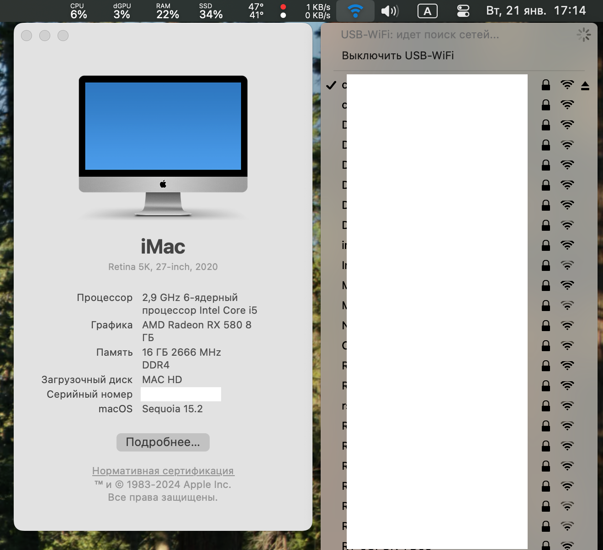

# Hackintosh EFI with OpenCore

### Hardware
+ Motherboard：ASUS PRIME B365M-A
+ CPU：Intel® Core™ i5-9400F Processor
+ GPU：GIGABYTE AMD Radeon RX 580

### Testing
+ macOS Sonoma 14.7.2
+ macOS Sequoia 15.2

### Use
+ [OpenCore](https://github.com/acidanthera/opencorepkg/releases) v1.0.3
+ [Wireless-USB-OC-Big-Sur-Adapter](https://github.com/chris1111/Wireless-USB-OC-Big-Sur-Adapter/releases/tag/V17) v17
+ [OCAuxiliaryTools](https://github.com/ic005k/OCAuxiliaryTools) 20240004

